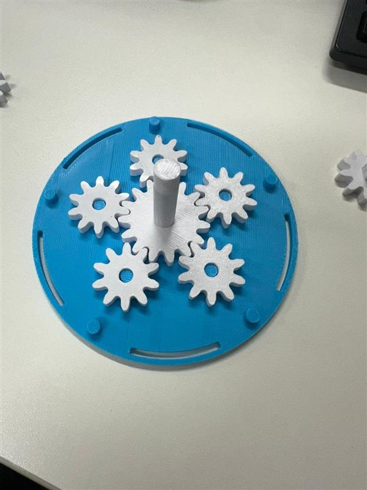
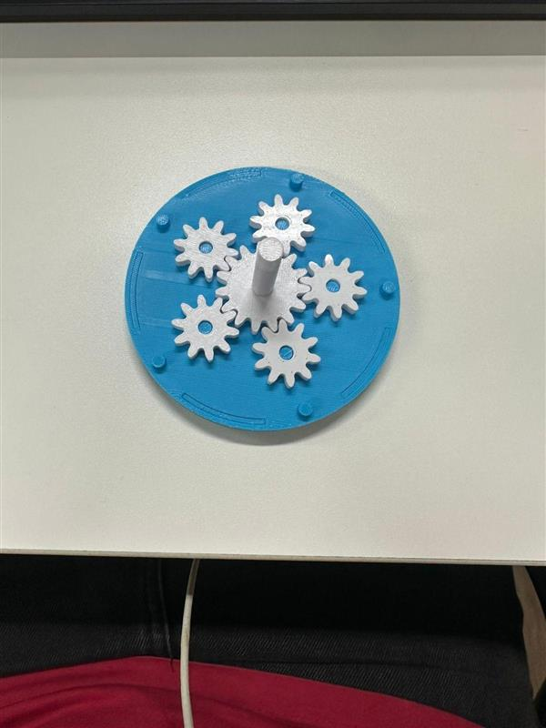
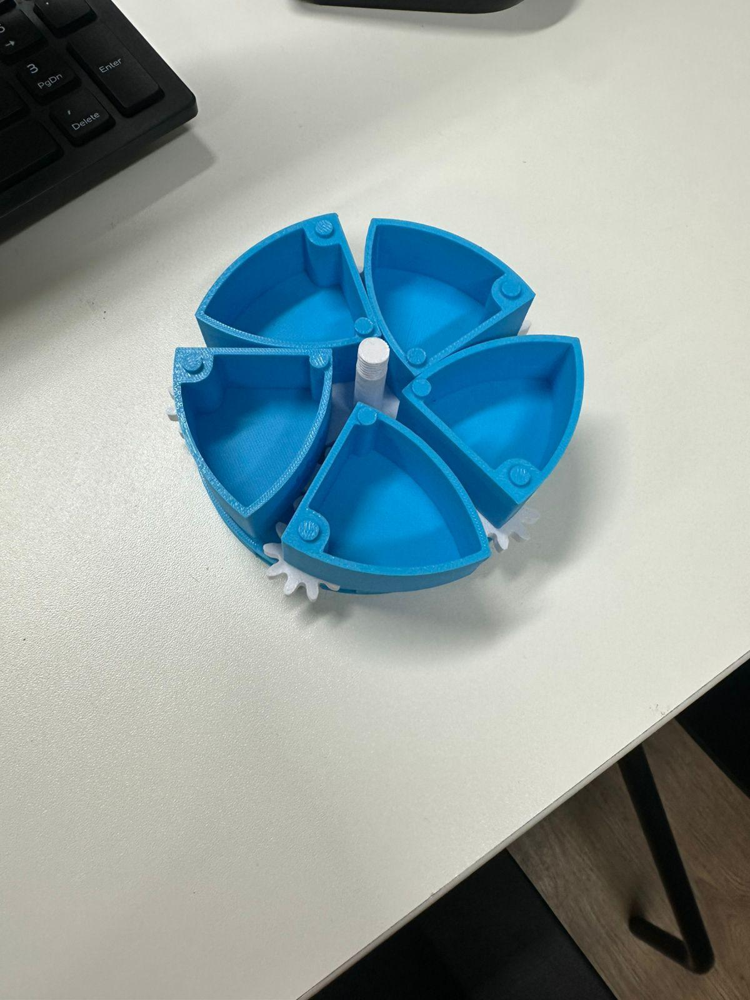
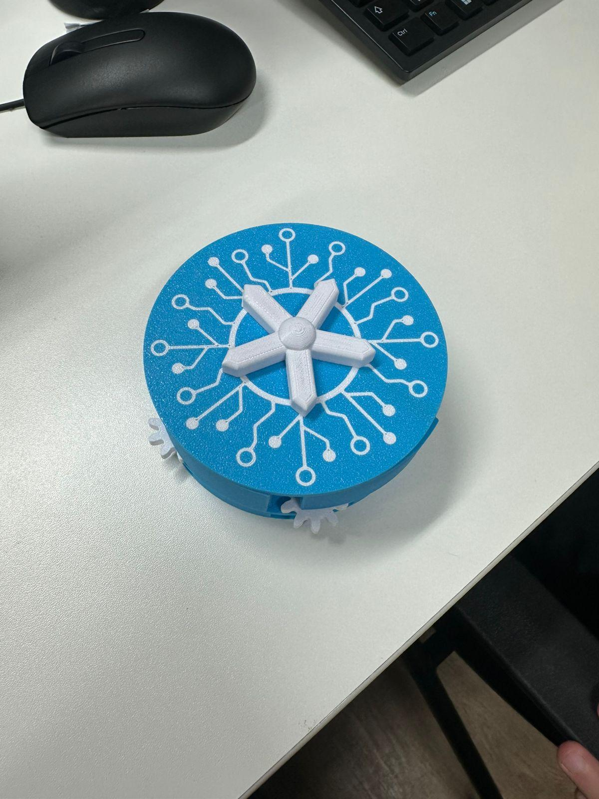
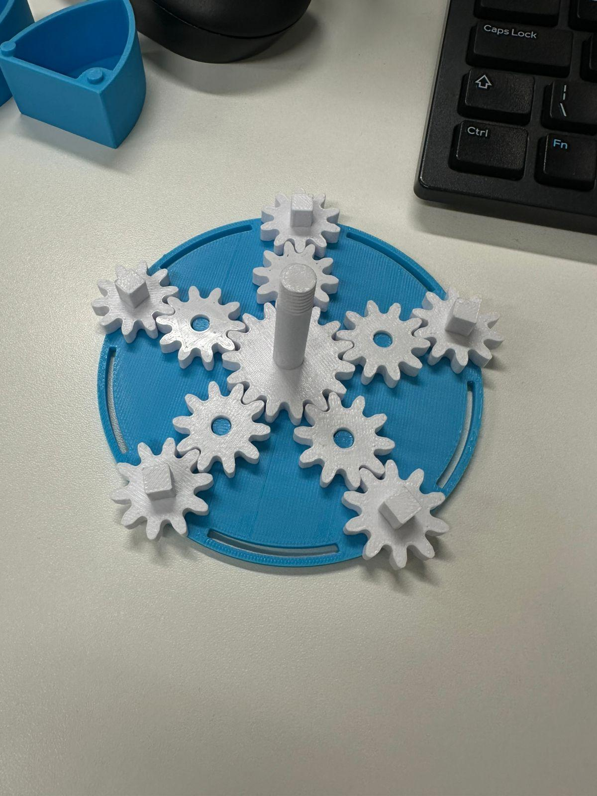
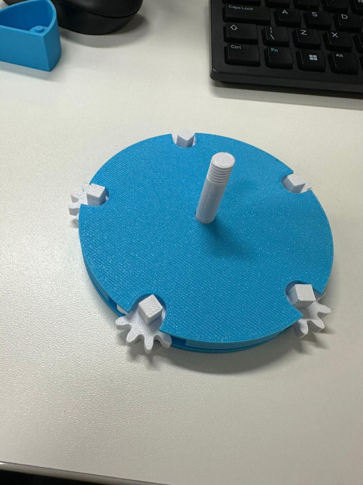
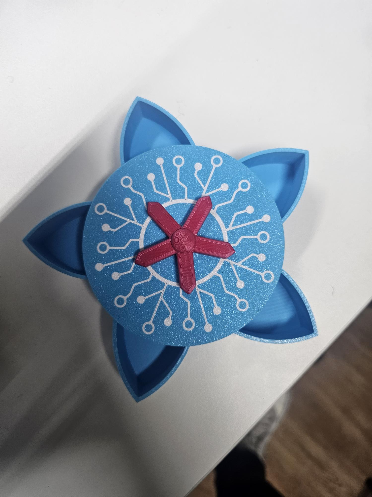

# Checkpoint02-Maker-Lab

## integrantes

* Márcio Gastaldi - RM98811
* Davi Desenzi - RM550849
* Arthur Bessa - RM99215
* Fabrício Gutierrez - RM97631
* Eduardo Nistal - RM94524

## Medidas:

### Componente móvel

* 43,6 mm - Comprimento

* 39 mm - Largura

* 21mm - Altura

### Eixo

* 35 mm - elice

* 11mm - altura circulo 

* 7mm - altura elice

* 7mm - diametro do oco

* 9mm - profundidade 

* 12 mm - eixo circulo

# Montagem

## Passo 1

## Passo 2

## Passo 3

## Passo 4

## Passo 5

## Passo 6

## Passo 7

# Perguntas

## O encaixe é “frouxo” ou “apertado”?

Ele é apertado, porém o encaixe é perfeito.

## O eixo gira livremente?

Sim, o eixo gira livremente

## As engrenagens engatam corretamente?

Sim.

## Há pontos onde encosta na parede da caixa?

Sim.

## O movimento trava em algum ponto?

Sim, ele trava ao abrir e ao fechar.

